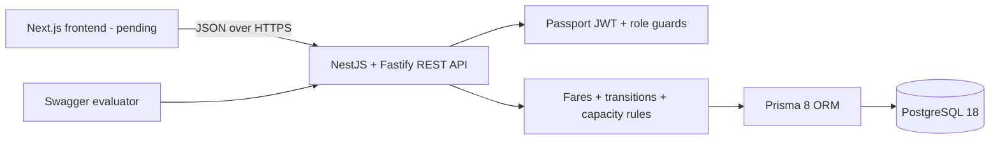
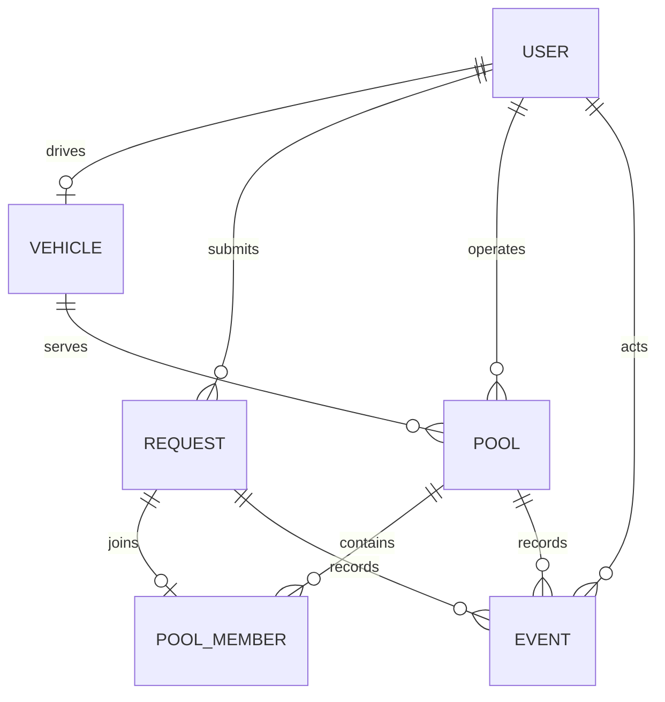

# Dhaka Tesla Pool

A small Tesla ride-pooling MVP for Dhaka. The implemented backend uses NestJS on Fastify, Prisma 8 ORM, PostgreSQL, Zod DTOs, Passport JWT authentication, Swagger, and Docker Compose.

Backend status: implemented and verified. The Next.js frontend is the next milestone and is intentionally not represented here as complete.

## Why REST

REST is a better fit than GraphQL for this MVP because the system has a small set of resources and explicit state-changing commands: create/cancel a request, accept a passenger, and advance a pool. It is easy to inspect in Swagger, exercise with `curl`, and explain during evaluation. GraphQL would add schema and client complexity without solving a current requirement.

## Architecture



Business rules stay in backend services and pure domain functions. Controllers only handle HTTP concerns, DTOs validate the boundary, guards enforce authentication/roles, and database writes that must agree are performed in transactions.

## Database design



| Table          | Purpose and important constraints                                                                                                  |
| -------------- | ---------------------------------------------------------------------------------------------------------------------------------- |
| `users`        | Passenger/driver identity, unique email, Argon2id password hash, role index.                                                       |
| `vehicles`     | One vehicle per driver, positive capacity, online/offline state.                                                                   |
| `requests`     | Passenger route, seats, payment method, fare quote, lifecycle status; indexed for passenger history and driver matching.           |
| `pools`        | Driver/vehicle snapshot, compatibility keys, lifecycle status, capacity and occupied seats; database check prevents over-capacity. |
| `pool_members` | One pool membership per request, seats and accepted fare; unique `requestId` prevents double assignment.                           |
| `events`       | Append-only request/pool state history with actor, transition, optional metadata, and time indexes.                                |

Auto-incrementing integer IDs keep this assessment easy to inspect. Authorization never relies on an ID being hard to guess: passenger reads and mutations are scoped by the authenticated passenger, and driver pool operations are scoped by the authenticated driver.

## Money and fare policy

Money is stored as PostgreSQL `Decimal` BDT with database checks for non-negative values and exactly two decimal places. This keeps values such as `123.40` human-readable. Fare calculations use integer poysha internally and convert to a two-decimal string only at the storage/API boundary, avoiding floating-point rounding errors.

The deliberately hand-testable rule is:

```text
solo fare = BDT 80.00 + BDT 20.00 per kilometre
pooled fare = solo fare × 80% (20% pool discount)
```

- Nusrat, Banani → Mohakhali, 3 km: `(80 + 20 × 3) × 0.8 = BDT 112.00`.
- Rafiq, Banani → Gulshan 1, 2.5 km: `(80 + 20 × 2.5) × 0.8 = BDT 104.00`.

`CASH` and simulated `TESLAPAY` are accepted payment choices. No real payment gateway is used.

## Ride and pool lifecycle

```text
REQUESTED -> MATCHED -> DRIVER_ARRIVED -> STARTED -> COMPLETED
     |           |
     +-----------+-> CANCELED
```

Only listed transitions are allowed. Each transition updates the affected request(s), pool, and event history in one transaction.

Pool matching requires the same pickup zone and corridor. A driver acceptance uses an atomic conditional SQL update equivalent to:

```sql
UPDATE pools
SET occupiedSeats = occupiedSeats + :requestedSeats
WHERE id = :poolId
  AND status = 'MATCHED'
  AND occupiedSeats + :requestedSeats <= capacity;
```

If no row is updated, the request receives `POOL_FULL`. The database check `occupiedSeats <= capacity` is a second line of defence. The integration test races two requests for the last seat and proves that exactly one succeeds.

## API

Base URL: `http://localhost:3000/api/v1`

Swagger UI: `http://localhost:3000/docs`

| Method | Route                                | Access          | Purpose                                                            |
| ------ | ------------------------------------ | --------------- | ------------------------------------------------------------------ |
| `GET`  | `/health`                            | Public          | Health check.                                                      |
| `POST` | `/auth/register`                     | Public          | Register a passenger. Public registration cannot create drivers.   |
| `POST` | `/auth/login`                        | Public          | Return a 15-minute bearer token.                                   |
| `GET`  | `/auth/me`                           | Authenticated   | Return validated token identity after a fresh database user check. |
| `GET`  | `/rides/options`                     | Passenger       | List fixed route choices and quotes.                               |
| `POST` | `/rides`                             | Passenger       | Create a ride request and initial event.                           |
| `GET`  | `/rides/me`                          | Passenger       | List only the current passenger's rides.                           |
| `GET`  | `/rides/:id`                         | Passenger owner | Read one owned ride.                                               |
| `POST` | `/rides/:id/cancel`                  | Passenger owner | Cancel an allowed state and release reserved seats if matched.     |
| `GET`  | `/driver/vehicle`                    | Driver          | Read the driver's vehicle.                                         |
| `POST` | `/driver/vehicle/online`             | Driver          | Go online.                                                         |
| `POST` | `/driver/vehicle/offline`            | Driver          | Go offline when no active pool exists.                             |
| `GET`  | `/driver/requests`                   | Driver          | List compatible unassigned requests.                               |
| `POST` | `/driver/requests/:requestId/accept` | Driver          | Atomically accept into a compatible pool or create one.            |
| `GET`  | `/driver/pools`                      | Driver          | List the driver's pools.                                           |
| `GET`  | `/driver/pools/:poolId`              | Driver owner    | Read one pool and member details.                                  |
| `POST` | `/driver/pools/:poolId/arrive`       | Driver owner    | Move matched pool/requests to arrived.                             |
| `POST` | `/driver/pools/:poolId/start`        | Driver owner    | Start a ride.                                                      |
| `POST` | `/driver/pools/:poolId/complete`     | Driver owner    | Complete a ride.                                                   |

Errors use one frontend-friendly shape:

```json
{
  "error": {
    "code": "VALIDATION_ERROR",
    "message": "Validation failed",
    "details": []
  },
  "requestId": "req-1",
  "timestamp": "2026-09-28T00:00:00.000Z"
}
```

Fastify request logs include the request ID. Helmet security headers, a 100 requests/minute rate limit, strict environment validation, short-lived JWTs, role guards, ownership checks, and response DTO serialization provide the basic security baseline.

## Seed accounts

All demo users use password `superstrongpassword`.

| Name   | Email                | Role                                        |
| ------ | -------------------- | ------------------------------------------- |
| Jashim | `jashim@example.com` | Driver of online Tesla `Bullet`, capacity 3 |
| Nusrat | `nusrat@example.com` | Passenger                                   |
| Rafiq  | `rafiq@example.com`  | Passenger                                   |
| Shirin | `shirin@example.com` | Passenger                                   |

The seed is idempotent: rerunning it updates the story cast instead of creating duplicates.

## Run the complete backend with Docker

Prerequisite: Docker Desktop with Compose.

```bash
cp .env.example .env
docker compose up --build --wait
docker compose ps -a
```

On PowerShell, use `Copy-Item .env.example .env` instead of `cp` if preferred.

Compose starts:

1. PostgreSQL and waits for `pg_isready`.
2. A one-shot `migrate` container that applies Prisma 8 migrations and seeds the story cast.
3. The API, which starts only after migration success and must pass `/api/v1/health`.

Override `JWT_ACCESS_SECRET`, `CORS_ORIGIN`, host `API_PORT`, or host `POSTGRES_PORT` in `.env`. If local development commands connect through a non-default PostgreSQL port, update the port in `DATABASE_URL` too. The fallback Compose secret is for local evaluation only.

Stop containers without deleting database data:

```bash
docker compose down
```

Do not add `-v` unless the local database volume is intentionally disposable.

## Run locally for development

Prerequisites: Bun 1.4.x and Docker.

```bash
bun install
cp .env.example .env
bun run db:up
bun --env-file=.env run migrate
bun --env-file=.env run db:seed
bun --env-file=.env run dev
```

Useful database commands:

```bash
bun --env-file=.env run contract:emit
bun --env-file=.env run migration:status
bun --env-file=.env run db:verify
```

## Verification

```bash
bun run typecheck
bun run test
bun --env-file=.env run test:integration
bun run build
docker compose config
docker compose up --build --wait
```

Verified backend results on 2026-09-28:

- 13 unit tests pass for fares and transition rules.
- The PostgreSQL concurrency integration test passes and cleans its isolated rows with Prisma 8 `deleteAll()`.
- Prisma reports contract/migration storage hash `7f2bec48f98e75de0632ab253abd2209a7beac48cfeea429276f50330f6a4284` as current.
- Docker migration/seed exits `0`; PostgreSQL and API health checks pass.
- Nusrat login, authenticated identity, Swagger, fare quotes, pooling, lifecycle completion, and late-cancel rejection were smoke-tested.

## Project layout

```text
src/
  auth/                 JWT, Passport, password hashing, auth DTOs
  common/               auth decorators/guards and stable errors
  config/               validated environment contract
  driver/               vehicle, matching, pooling, lifecycle
  prisma/               Prisma 8 contract, generated contract, seed, DB runtime
  rides/                passenger API, fares, routes, transition rules
test/                   database concurrency integration test
migrations/             committed Prisma 8 migrations and snapshots
docs/implementation-guide/
                        step-by-step implementation and AI log
Dockerfile
docker-compose.yml
```

## Git workflow

The assignment's required flow is followed:

```text
feature/* -> master -> pre-release -> release/v1.0.0
```

Completed, tested feature branches are merged into `master` with merge commits. `pre-release` is intentionally not advanced until the whole MVP, including the frontend, is ready for acceptance. `release/v1.0.0` should be created only after the pre-release checklist passes; release is the last merge stage, not the place for unfinished work.

## Deployment

No paid service is required. A public deployment has not been created yet because suitable always-free backend/database availability can change and the frontend is unfinished. The Docker setup is the reproducible deployment fallback: any free VM/container host that supports Docker Compose can run the same stack. If a public host is selected later, use only a confirmed free tier, supply secrets through the host, run migrations before API startup, and point the frontend at the public API URL.

## AI usage disclosure

OpenAI Codex was used to analyze the assignment, recover and maintain the implementation guide, troubleshoot PostgreSQL 18 Docker storage, review the Prisma 8 schema/seed, implement the backend in feature branches, and propose/test authentication, fare, pooling, error, Swagger, test, and Docker code.

Material accepted suggestions include atomic conditional seat allocation, a database capacity check, exact Decimal BDT storage with integer-poysha calculations, database-backed JWT user validation, and a real final-seat race test. Material suggestions changed or rejected include replacing simple integer IDs with UUIDs, storing money only as an integer column, adding revocable session infrastructure outside this MVP, and merging unfinished work directly to pre-release. Every accepted change was reviewed and verified with relevant type checks, tests, builds, database checks, or Docker smoke tests.

The detailed record is in `docs/implementation-guide/ai-usage-log.md`. Do not present AI output as unreviewed original work; be prepared to explain and modify every submitted line. No secrets or real customer data should be entered into AI tools.

## Remaining assignment work

- Implement the Next.js passenger/driver interface with loading, error, empty, pending, and terminal states.
- Add the `web` container to Compose and test the complete browser flow.
- Capture screenshots/architecture assets as required by the final submission.
- Perform the pre-release acceptance pass, create `release/v1.0.0`, deploy publicly if a suitable free tier is available, and record the six-minute demo video.
