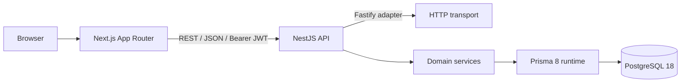
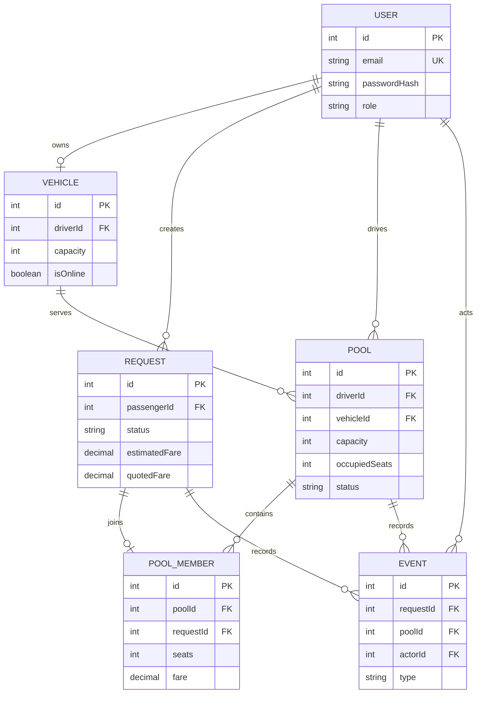

# Step 2 - architecture and code boundaries

## Runtime architecture



Keep the browser away from PostgreSQL. Do not put authoritative fare, capacity, role, passenger ID, or status logic in the frontend.

## ERD



Update these diagrams if the implementation changes.

## Code responsibilities

| Layer                    | Responsibility                                   | Must not do                                     |
| ------------------------ | ------------------------------------------------ | ----------------------------------------------- |
| Controller               | HTTP mapping, guards, DTO boundary, status codes | Direct database calls or fare calculations      |
| Application service      | Use case, ownership, transaction boundary        | Trust IDs/status/fare supplied by browser       |
| Domain function          | Pure fare, route compatibility, transition rules | Read environment or database                    |
| Repository/Prisma access | Typed persistence and atomic SQL                 | Decide HTTP status or expose password hashes    |
| Exception filter         | Stable error envelope and safe logging           | Return internal stack traces                    |
| Frontend API client      | Send requests and normalize transport failures   | Enforce authoritative capacity or authorization |

## Transaction boundaries

Use one database transaction for each operation that changes more than one invariant:

- Create request plus creation event.
- Accept request, reserve seats, create membership, change request status, create events.
- Cancel matched request, remove membership, release seats, change status, create events.
- Driver lifecycle transition plus request/pool history.

## Error contract

Use one response shape:

```json
{
  "statusCode": 409,
  "code": "POOL_FULL",
  "message": "The requested seats are no longer available",
  "requestId": "http-request-id"
}
```

Recommended mappings:

| Situation                    | HTTP | Code                 |
| ---------------------------- | ---: | -------------------- |
| Invalid DTO                  |  400 | `VALIDATION_ERROR`   |
| Missing/bad/expired JWT      |  401 | `UNAUTHORIZED`       |
| Wrong role                   |  403 | `FORBIDDEN`          |
| Foreign private resource     |  404 | `NOT_FOUND`          |
| Illegal lifecycle transition |  409 | `INVALID_TRANSITION` |
| No seats after atomic claim  |  409 | `POOL_FULL`          |
| Unsupported route            |  422 | `UNSUPPORTED_ROUTE`  |

## Technology decisions for README

For PostgreSQL, Prisma 8, NestJS/Fastify, REST, Passport JWT, `nestjs-zod`, Next.js, Vitest, and deployment, document:

1. What was chosen.
2. A realistic alternative.
3. Why the choice fits this pooling MVP.
4. What future condition would make you switch.

## Acceptance gate

- Architecture and ERD match code names and runtime boundaries.
- Business rules live in services/pure functions, not controllers.
- Every multi-row invariant has a named transaction boundary.
- Error codes are stable enough for frontend rendering and tests.
